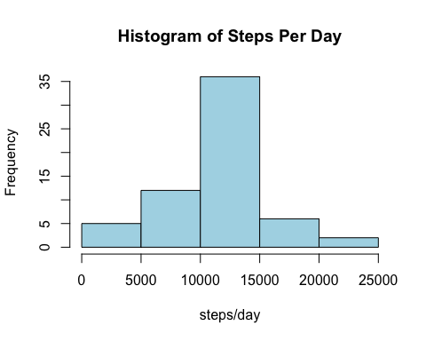

# Project 1, Week 2 Reproducible Research Class

The data file used in this analysis can be found at the Coursera.org Reproducible Research Class web site. It complies data from personal activity monitors and reports the number of steps in a five minute interval, date, and the five minute interval label.  
  
##Loading and preprocessing the data

```r
library(dplyr)
library(lattice)
options(scipen=999)
download.file("http://d396qusza40orc.cloudfront.net/repdata%2Fdata%2Factivity.zip","temp",mode="wb")
unzip("temp","activity.csv")
x <- read.csv("activity.csv")
```
##What is mean total number of steps taken per day?
####1. Calculate the total number of steps per day:

```r
sum_steps <- summarize(group_by(x,date),total=sum(steps))
print(sum_steps)
```

```
## Source: local data frame [61 x 2]
## 
##          date total
## 1  2012-10-01    NA
## 2  2012-10-02   126
## 3  2012-10-03 11352
## 4  2012-10-04 12116
## 5  2012-10-05 13294
## 6  2012-10-06 15420
## 7  2012-10-07 11015
## 8  2012-10-08    NA
## 9  2012-10-09 12811
## 10 2012-10-10  9900
## ..        ...   ...
```
####2. Plot total steps per day in a histogram:

```r
with(sum_steps,hist(total,main="Histogram of Steps Per Day", xlab="steps/day",col="light blue"))
```

 

####3. Take the mean and median of the steps:

```r
mean_steps <- with(sum_steps,mean(total,na.rm=TRUE))
mean_steps
```

```
## [1] 10766.19
```

```r
median_steps <- with(sum_steps,median(total, na.rm=TRUE))
median_steps
```

```
## [1] 10765
```

The mean number of steps per day is 10766, rounded to nearest integer.  
The median number of steps per day is 10765.  

##What is the average daily activity pattern?
####1. Plot timeseries of the 5-minute interval and the average number of steps taken, averaged across all days

```r
mean_steps_interval <- summarize(group_by(x,interval),mean_steps=mean(steps,na.rm=TRUE))
mean_steps_interval
```

```
## Source: local data frame [288 x 2]
## 
##    interval mean_steps
## 1         0  1.7169811
## 2         5  0.3396226
## 3        10  0.1320755
## 4        15  0.1509434
## 5        20  0.0754717
## 6        25  2.0943396
## 7        30  0.5283019
## 8        35  0.8679245
## 9        40  0.0000000
## 10       45  1.4716981
## ..      ...        ...
```

```r
with(mean_steps_interval, plot(interval,mean_steps,type='l',main="Average Number of Steps Taken Per Interval",xlab="Average Number of Steps",ylab="5-minute Interval",col="blue"))
```

 

####2. Which 5-minute interval, on average across all the days in the dataset, contains the maximum number of steps?  


```r
max_step_row <- filter(mean_steps_interval, mean_steps==max(mean_steps))
max_step_row
```

```
## Source: local data frame [1 x 2]
## 
##   interval mean_steps
## 1      835   206.1698
```
The 5-minute interval that contains the maximum number of steps is 835 and the number of steps contained in that interval is 206, rounded to the nearest integer.  

##Imputing Missing Values  
####1. Calculate and report the total number of missing values in the dataset

```r
missing <- filter(x,is.na(steps))
nrow(missing)
```

```
## [1] 2304
```
The number of missing values in the dataset is 2304. 

####2-3. Devise a strategy for filling in all of the missing values in the dataset. Create new dataset y. 
The following code replaces the steps NA values with the mean value for that 5-minute interval, rounded to nearest integer.  


```r
y <- left_join(x,mean_steps_interval,by="interval")
y <- transmute(y,steps=ifelse(is.na(steps),round(mean_steps),steps),date,interval)
head(y)
```

```
##   steps       date interval
## 1     2 2012-10-01        0
## 2     0 2012-10-01        5
## 3     0 2012-10-01       10
## 4     0 2012-10-01       15
## 5     0 2012-10-01       20
## 6     2 2012-10-01       25
```

####4. Make a histogram of the total number of steps taken each day and Calculate and report the mean and median total number of steps taken per day.  

```r
sum_steps_new <- summarize(group_by(y,date),total=sum(steps))
```

```r
with(sum_steps_new, hist(total,main="Histogram of Steps Per Day", xlab="steps/day",col="light blue"))
```

 

```r
mean_steps_new <- with(sum_steps_new,mean(total))
mean_steps_new
```

```
## [1] 10765.64
```

```r
median_steps_new <- with(sum_steps_new,median(total))
median_steps_new
```

```
## [1] 10762
```

The mean number of steps per day is 10766, rounded to nearest integer.  
The median number of steps per day is 10762.  

The difference between removing the NA values and estimating the missing values on the mean and median number of steps per day is very small. Both approaches give similar results.  

##Are there differences in activity patterns between weekdays and weekends?
####1. Create a new factor variable in the dataset with two levels -- "weekday" and "weekend" indicating whether a given date is a weekday or weekend day

```r
y <- mutate(y,day=weekdays(as.Date(y$date)))
y <- mutate(y,weekday=ifelse(grepl("^S",y$day),"weekend","weekday")) # weekend day names start with "S", weekdays do not
head(y)
```

```
##   steps       date interval    day weekday
## 1     2 2012-10-01        0 Monday weekday
## 2     0 2012-10-01        5 Monday weekday
## 3     0 2012-10-01       10 Monday weekday
## 4     0 2012-10-01       15 Monday weekday
## 5     0 2012-10-01       20 Monday weekday
## 6     2 2012-10-01       25 Monday weekday
```
####2. Average number of steps taken for each 5-minute interval, weekends vs. weekdays. Plot.

```r
steps_interval_daytype <- summarize(group_by(y,interval,weekday),mean_steps=mean(steps))
head(steps_interval_daytype)
```

```
## Source: local data frame [6 x 3]
## Groups: interval
## 
##   interval weekday mean_steps
## 1        0 weekday  2.2888889
## 2        0 weekend  0.2500000
## 3        5 weekday  0.4000000
## 4        5 weekend  0.0000000
## 5       10 weekday  0.1555556
## 6       10 weekend  0.0000000
```

```r
with(steps_interval_daytype,xyplot(mean_steps~interval|weekday,layout=c(1,2),type='l',xlab="5-minute Interval",ylab="Average Number of Steps"))
```

 

